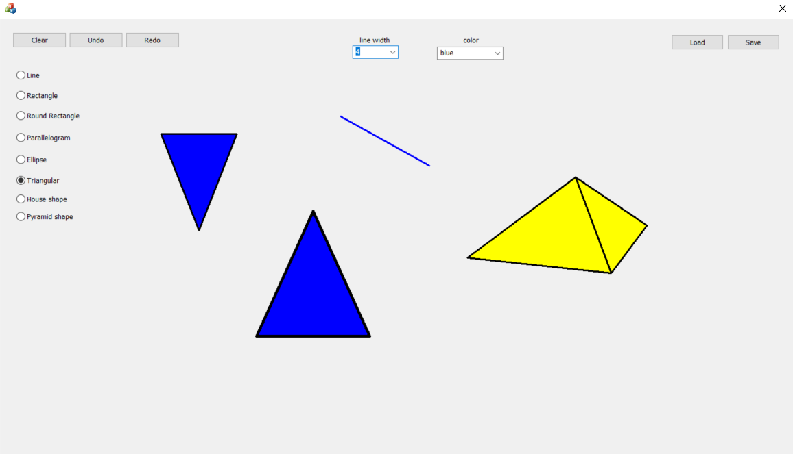

# Paint-MFC
C++ paint using MFC. Study project

MFC application using C++ and OOP to create a painting app, implementing OOP for the shapes.

The app provides a few options: 
1. Choose a shape.
2. Fill the shape with colors. 
3. Control the line width.
4. Undo or redo.
5. Save the painting and load it.

## Screenshots:
-The app:

